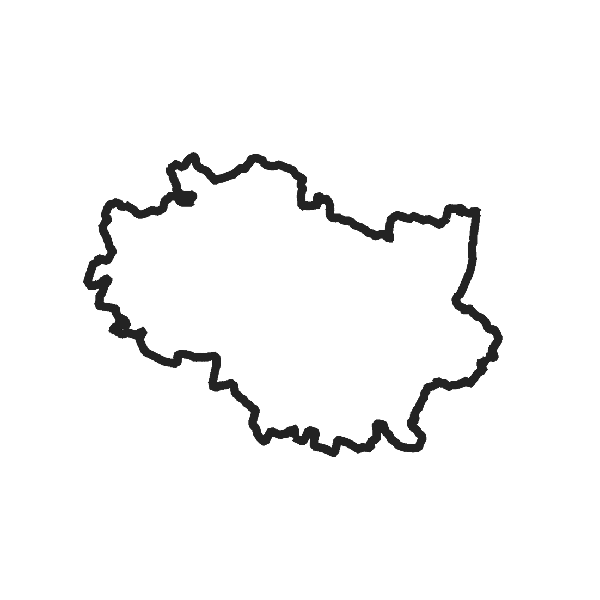

<!--  -->
<p align="center">
    
</p>

# Kraina Website

This is a repository for Kraina website implemented in Quarto.

## Description

Kraina is a geospatial research group under Wrocław University of Science and Technology.

## Getting Started

### Installing

* To install Quarto visit [here](https://quarto.org/docs/get-started/)

* To install the dependencies:

    ```sh
    pip install -r requirements.txt
    ```

### Rendering

Install [the quarto extension](https://marketplace.visualstudio.com/items?itemName=quarto.quarto) for VSCode and then from the command palette:

```txt
>Quarto: Render Project
```

## License

This project is licensed under the Apache 2.0 License - see the LICENSE.md file for details.